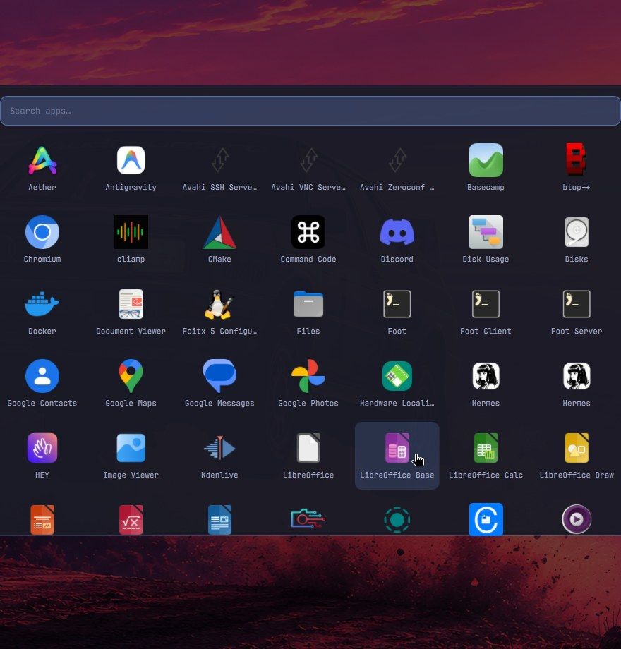

# Floating Dock

A floating dock for [Omarchy](https://omarchy.org) — a
mouse-first way to launch, switch, and manage apps on a keyboard-first
desktop. Familiar if you come from macOS or Windows: one dock for
everything, window previews on hover, a real start-menu launcher, and a
taskbar that behaves the way you already expect.

Built as a native `omarchy-shell` plugin, the same technology as
Omarchy's bar and OSD, so it follows your theme automatically and
survives theme switches without configuration.




## Features

- **Pinned launchers** in a glassy capsule, with hover magnification and
  a launch bounce.
- **Every running app is in the dock**, pinned or not — unpinned apps
  appear to the right of a divider, macOS style, so any open program is
  one click away no matter how it was launched.
- **Click to focus, across workspaces** — clicking a running app takes
  you to its window wherever it lives; the compositor switches
  workspaces for you. Clicking again cycles through that app's other
  windows.
- **Hover window previews** — hovering a running app shows a live
  snapshot of its focused window with working **Minimize / Maximize /
  Close** buttons, like the macOS Dock and the Windows 11 taskbar.
- **A real right-click menu** — *Minimize*, *Maximize*, *New Window*, a
  jump list of the app's open windows by title, *Quit*, and *Pin /
  Unpin*.
- **App launcher** — a Launchpad-style popup with an app grid and a
  type-to-filter search field. Click the grid icon (or press its
  keybind), type part of an app's name, hit Enter. ESC or a click
  outside closes it.
- **Four placements** — bottom, left, right, or top. On top it sits
  below Omarchy's own bar (the bar keeps the screen edge, always).
- **Minimize and restore** — right-click (or hover the preview) and use
  Minimize; click the dock icon to restore it to your current workspace.
- **Drag to reorder** pinned icons; the order persists.
- **Auto-hide** — the dock slides off-screen when you're not using it
  and slides back when the pointer touches its edge (off by default).
- **Running indicators** — an accent-colored ring around every app with
  an open window (no more guessing whether it's running).
- **Popups can't hang around** — hover cards and menus dismiss on
  pointer-leave and are force-closed after 30 seconds no matter what.
- **Theme-aware** — colors derive from the active Omarchy theme, with a
  toned-down treatment on light themes.

Window tracking, focusing, cycling, previews, and closing all ride on
stable Wayland protocols (foreign-toplevel management), not
compositor-specific APIs — see [Design notes](#design-notes) for what
that buys you and where the two Hyprland-bound pieces live.

## Requirements

- Omarchy with `omarchy-shell` plugin support (the `omarchy plugin`
  command).
- Nothing else. Icons look best with the Papirus icon theme installed
  (`/usr/share/icons/Papirus`), which Omarchy ships; the dock falls back
  to your normal icon theme, then to a generic tile, when Papirus
  doesn't cover an app.

## Install

```bash
omarchy plugin add https://github.com/randomchaos7800-hub/omarchy-dock.git --enable
```

Or manually:

```bash
git clone https://github.com/randomchaos7800-hub/omarchy-dock.git ~/.config/omarchy/plugins/dino.dock
omarchy plugin enable dino.dock
```

> **Read before you run.** Plugins execute as arbitrary, unsandboxed
> code inside your long-lived `omarchy-shell` process. Read `Dock.qml`
> before enabling anything you didn't write yourself — this plugin
> included.

To update later: `omarchy plugin update dino.dock`.

## Using the dock

| Action | Result |
|---|---|
| **Click** a pinned app | Focuses its window (switching workspaces if needed), or launches it if it isn't running |
| **Click** a running app again | Cycles to that app's next window |
| **Click** a minimized app | Restores it to the workspace you're on |
| **Click** an unpinned running app | Focuses it — same as a pinned one |
| **Hover** a running app | Window preview card: live snapshot + Minimize / Maximize / Close |
| **Hover** a pinned, not-running app | Small pill with ✕ to unpin |
| **Right-click** any icon | Menu: *Minimize* · *Maximize* · *New Window* · window jump list · *Quit* · *Pin / Unpin* |
| **Click a title** in the jump list | Focuses exactly that window, wherever it is |
| **Quit** | Closes every window of that app (via the window-management protocol — the app can still prompt to save) |
| **Grid icon** (leftmost) | Opens the app launcher: search field + app grid |
| **Type in the launcher** | Filters the grid live; **Enter** launches the first match, **ESC** / click outside closes |
| **Drag** a pinned icon left/right | Reorders it; an accent bar previews where it will land |
| **Pointer to the dock's screen edge** | Reveals the dock when auto-hidden |

Notes on behavior:

- The launch bounce only plays for actual launches. Focusing an
  already-running window switches instantly, no theatrics.
- Unpinning an app with open windows doesn't quit anything — its icon
  just slides over to the running section.
- The jump list shows up to 8 windows per app.
- Dialogs and desktop-portal helper windows are filtered out of the
  running section; they aren't apps to you.

## Configuration

All three configuration files live in `~/.config/omarchy/` — one
directory **above** the plugin checkout. That's deliberate: the shell
reloads a plugin whenever anything inside its directory changes, so
config written into the plugin directory would remount the dock on every
save (and, for the pin file, mid-click). Files there also dirty the git
checkout that `omarchy plugin update` pulls into. Legacy in-plugin
copies of `pinned.json` and `monitor.json` are still read as fallbacks,
so upgrades from older versions keep working with no migration step.

All three files hot-reload on save.

### Pinned apps — `dino.dock.pinned.json`

Normally you never edit this: **right-click an icon** and use *Pin to
Dock* / *Unpin from Dock*, or **drag** to reorder. The file exists so
you can also manage pins like configuration — it's a plain JSON array of
desktop-entry IDs, left to right:

```json
["foot", "org.gnome.Nautilus", "chromium"]
```

The ID is the `.desktop` filename without the extension. List what's
installed with:

```bash
ls /usr/share/applications/*.desktop | xargs -n1 basename | sed 's/\.desktop$//'
```

Sizing rules:

- **10–12 pins is the sweet spot** for icon size at full magnification.
- Past ~12–14, icons shrink to keep the dock under ~86% of screen
  width — the same trade-off the real macOS dock makes.
- **20 is the hard cap**; entries past 20 are dropped with a warning in
  the shell log.

A typo'd ID still renders (generic icon, the ID as its label) rather
than vanishing, so mistakes are visible instead of silent.

### Monitor targeting — `dino.dock.monitor.json`

Single monitor: skip this; the dock uses the first screen Quickshell
enumerates.

Multiple monitors: the file holds one JSON string — any case-insensitive
substring of the target screen's manufacturer, model, or connector name:

```json
"Odyssey G50F"
```

or

```json
"DP-2"
```

Prefer manufacturer/model: it survives a docking station renumbering
connectors across reboots (`DP-5` today, `DP-6` tomorrow), which a bare
connector name doesn't. An unquoted plain string is forgiven too. No
file, or an empty one, means no preference.

### Settings — `dino.dock.settings.json`

Three knobs:

```json
{ "position": "bottom", "autohide": false, "popupTimeoutMs": 30000 }
```

- `position` — `bottom` (default), `top`, `left`, or `right`. On **top**,
  Omarchy's own bar stays at the screen edge and the dock sits directly
  below it; on the sides the dock is a vertical strip.
- `autohide` — defaults to **false** (a normal, always-visible dock/taskbar).
  When set to `true`, the dock hides about 0.7s after the pointer leaves it
  and reveals when the pointer touches the dock's screen edge. While
  auto-hide is on, a 2-pixel strip along that edge is reserved to catch the
  reveal — the standard hidden-taskbar trade-off. An open right-click menu,
  a window preview, or an in-flight drag always holds the dock on screen.
- `popupTimeoutMs` — the lifetime cap for hover previews and menus in
  milliseconds (default `30000`, minimum `1000`). Whatever happens, a
  popup is force-closed at the cap so nothing can linger indefinitely.

All three files hot-reload on save. Placements screenshot set:
[left](docs/screenshots/placement-left.png) ·
[right](docs/screenshots/placement-right.png) ·
[top](docs/screenshots/placement-top.png).

## Design notes

**Stable protocols over compositor APIs.** Window tracking, focusing,
cycling, and closing all ride on the Wayland *foreign-toplevel
management* protocol via Quickshell — not on Hyprland-specific IPC. That
means dock behavior survives compositor upgrades untouched. It's also
why the dock has no Minimize (below).

**How app matching works.** Wayland offers no guaranteed mapping from a
window's `app_id` to the `.desktop` entry that launched it, so the dock
matches conservatively, in order: exact desktop-entry ID, the entry's
`StartupWMClass`, and — for Chromium-style webapps
(`chrome-app.fastmail.com__mail-Default`) — the site's domain tokens, so
an Omarchy webapp matches its own desktop entry. Matching is
deliberately exact, never substring-fuzzy: `code` can never claim
`code-oss`'s windows, and a short ID can't light the wrong pin's dot.

**Icons.** Papirus art is preferred for its consistent style, falling
back to your icon theme, then to a generic tile — so a window that ships
no icon at all still gets a clickable, visible slot.

### Why minimize goes through a helper

Everything portable — window tracking, focusing, cycling, closing —
rides on the foreign-toplevel protocol. Minimize and Maximize can't:
Hyprland 0.56 has no native minimize, and its `hyprctl dispatch`
interface is now evaluated as Lua by the embedded interpreter, which is
fast-moving and not stable protocol surface. So the two Hyprland-bound
actions live in one small, auditable Python helper, `dock_helper.py`:

- **Minimize** parks the window in the `special:scratchpad` workspace —
  the same mechanism as Omarchy's scratchpad (SUPER + S). Nothing is
  killed, the app keeps state.
- **Restore** moves it back to the workspace you're actually on, then
  focuses it.
- **Maximize/Fullscreen** toggles Hyprland's fullscreen mode.

Clicking a dock icon of a minimized app also restores it. If a future
Wayland protocol grows a portable minimize, the helper shrinks away and
the dock code doesn't change.

### How window previews work

Hovering a running app asks the helper for window geometry (position,
size, workspace), picks the app's focused window on your current
workspace, and grabs that region with `grim` — the same way Omarchy's
own screenshot tool works. The snapshot is what you see in the preview
card; the – / □ / ✕ buttons in its header are real window actions.
Previews are snapshots, not live mirrors — a still frame refreshed on
hover, like a lightweight taskbar preview.

### How the launcher works

The launcher is a layer-shell overlay: it takes keyboard focus while
open, so typing goes straight to its search field. ESC or a click
outside closes it, and Enter launches the top match. The grid is your
installed desktop entries (hidden entries filtered); the search matches
app names, so "calc" finds LibreOffice Calc. The *pin* matching that
decides which icon a running window belongs to stays exact — desktop
entry ID plus `StartupWMClass`, never substring-fuzzy, so a short query
can't light the wrong pin.

## Troubleshooting

- **No running ring for an app** — its `app_id` doesn't match its desktop
  entry by any of the rules above. Fix it at the source: add
  `StartupWMClass=<its app_id>` to the app's `.desktop` file. Find the
  `app_id` with `hyprctl clients -j | grep class`.
- **An app shows a generic gear icon** — it resolves to no icon in
  Papirus, your theme, or its desktop entry. Same fix: give its desktop
  entry an `Icon=`.
- **Minimize/Maximize does nothing** — check the helper runs:
  `/usr/bin/python3 ~/.config/omarchy/plugins/dino.dock/dock_helper.py`
  with no arguments should print its usage. `grim` must be installed
  (it ships with Omarchy) for the hover previews.
- **Dock is on the wrong monitor** — set
  `~/.config/omarchy/dino.dock.monitor.json` (see above).
- **Dock seems gone** — auto-hide is probably on; push the pointer to
  the dock's screen edge. If it truly isn't there, check
  `omarchy plugin list` and the shell log under
  `/run/user/$UID/quickshell/by-id/*/log.log` for `dino.dock` errors.
- **Edited a config file and the whole dock blinked** — you edited the
  legacy copy inside the plugin directory, which triggers a full plugin
  reload. Use the `~/.config/omarchy/dino.dock.*.json` locations.

## Removing / disabling

```bash
omarchy plugin remove dino.dock
```

or manually: delete the plugin directory and remove the
`{"id": "dino.dock"}` entry from the `plugins` array in
`~/.config/omarchy/shell.json`. Your config files under
`~/.config/omarchy/dino.dock.*.json` are yours to keep or delete.

## Files

- `manifest.json` — plugin manifest (kind `panel`, `keepLoaded: true`:
  mounted at shell startup and stays up, like the OSD).
- `Dock.qml` — the dock, popup, hover previews, launcher: the entire UI.
- `dock_helper.py` — the two Hyprland-bound window actions (minimize /
  maximize / geometry for previews), one auditable file, no state.
- `assets/omarchy-launcher.svg` — the launcher glyph, drawn to match the
  Papirus style.
- `pinned.json` (in-repo) — first-run defaults, and the legacy fallback
  read until your `~/.config/omarchy/dino.dock.pinned.json` exists.
- `~/.config/omarchy/dino.dock.pinned.json` — your pins (managed by
  right-click and drag; hand-editable).
- `~/.config/omarchy/dino.dock.monitor.json` — optional monitor
  targeting.
- `~/.config/omarchy/dino.dock.settings.json` — optional settings
  (`position`, `autohide`, `popupTimeoutMs`).

## Contributing & support

PRs are welcome — the plugin is ~2,000 lines of QML plus one helper
script, and deliberately avoids inventing anything the Wayland
protocols already cover. If this saved you from memorizing yet another
shortcut, you can sponsor development:

- GitHub Sponsors: [github.com/sponsors/JinUltimate1995](https://github.com/sponsors/JinUltimate1995)
- Or star the repo and tell other Omarchy users — that's support too.

See `FUNDING.yml` and `CONTRIBUTING.md`.

## License

MIT — see `LICENSE`.
